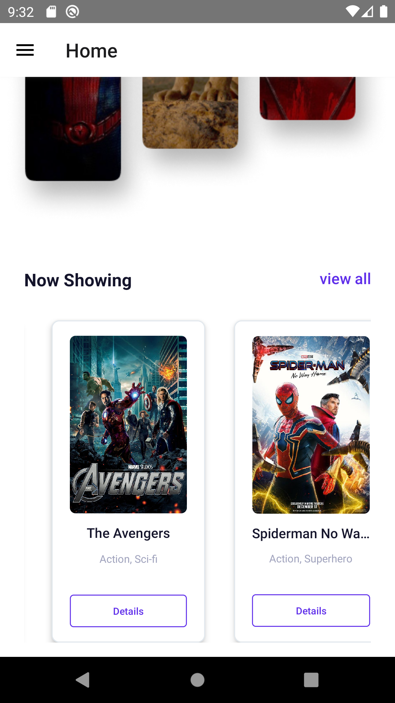
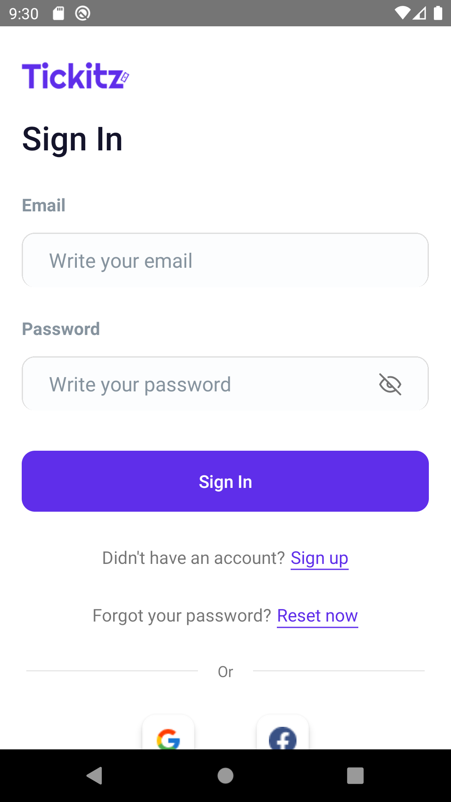
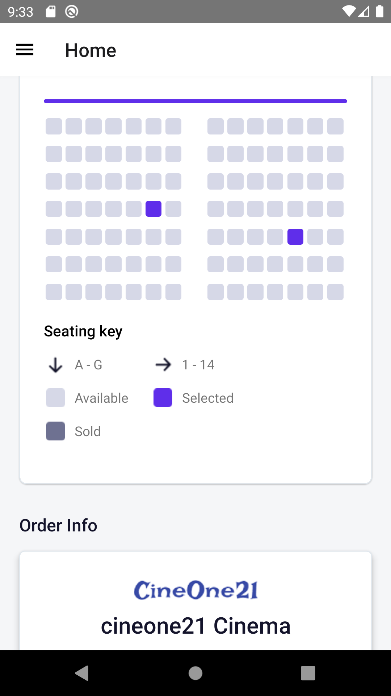
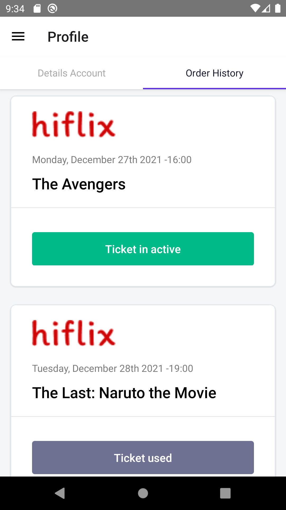

# Cinetix Mobile App

    

## Contents

- [Description](#description)
- [Features](#features)
- [Techs](#techs)
- [Installation](#installation-for-development)
- [Screenshoots](#screenshoots)
- [Demo Project](#demo-project)
- [Backend Repository](#backend-repository)

## Description

**Tickitz Mobile App** is a simple ticketing application that can facilitating consumers to booking a ticket in a cinema, whether order 1 or more ticket in one transaction. this is the repository for the frontend app, you can check the backend repository below.

## Features

Features in this project:

- Authentification(Login, Register)
- Order movie by choosing date, premiere, seat
- Order history

## Techs

Tech that use in this project:

- [Nodejs](https://nodejs.org/en/docs/)
- [React Native](https://reactnative.dev/)

## Installation for Development

1. Open your terminal or command prompt
2. Type `git clone https://github.com/AhmadZaky19/Cinetix-Frontend.git`
3. Type `npm install` to installing dependencies
4. run `npx react-native run-android` to run the in your device/emulator

## Screenshoots

## Demo Project

For the aplication you can download & try it in [[here](https://drive.google.com/file/d/1LkyZmh5T4aI5z6icGZCFBLKYk0Ja1Bm6/view?usp=sharing)]

## Backend Repository

For the backend repository you can check it in [here](https://github.com/AhmadZaky19/Cinetix-Backend)
